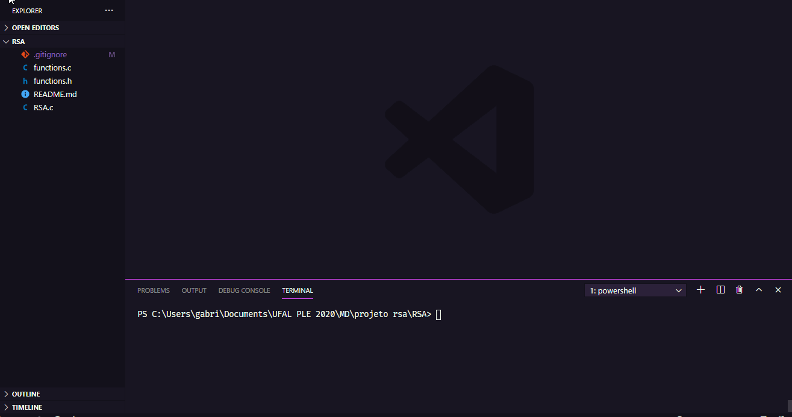

# Projeto Final - Criptografia RSA

## Projeto realizado para demonstrar o funcionamento da criptografia RSA

- ### **Grupo:**
    - Carlos Aleandro Lopes Pessoa
    - Daniel Pessoa Máximo
    - Gabriel Araújo Ferreira
    - Paulo Roberto Mendes dos Santos
    - Saulo Roberto dos Santos

## Compilando
Para compilar o projeto utilize o seguinte comando no terminal:
```
$ gcc *.c -o rsa
```
Com o arquivo **<u>rsa.exe</u>** gerado o rode o programa com o comando:
```
$ ./rsa
```
Depois é só seguir as opções disponíveis no menu e realizar a criptografia.

### Exemplo:


;